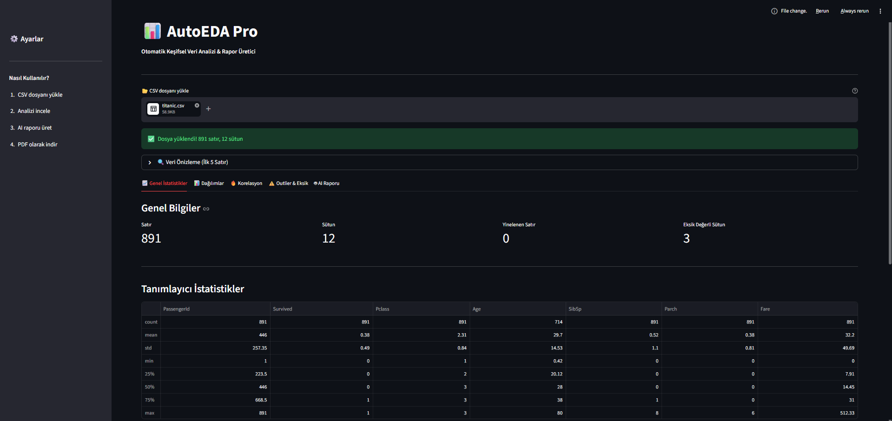
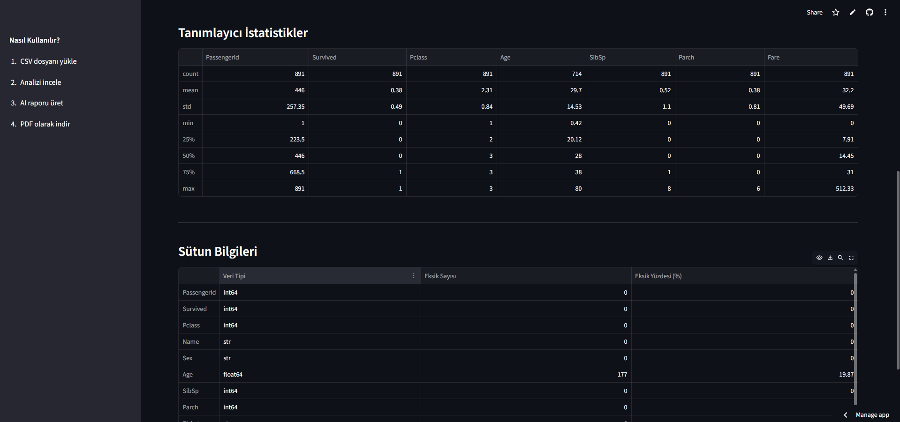
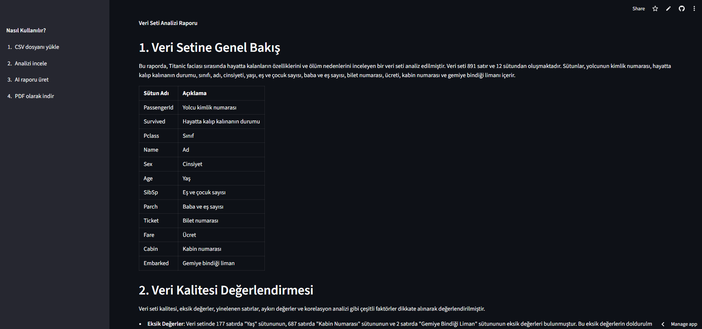
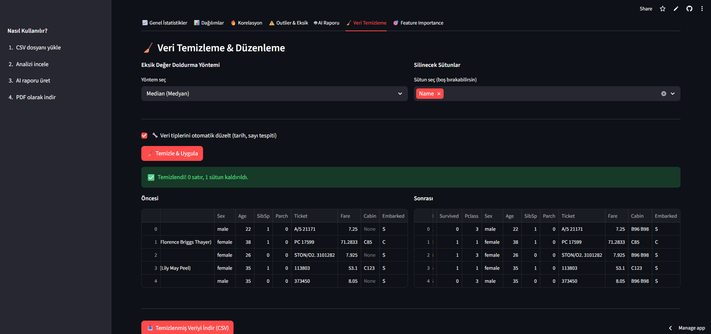

# 📊 AutoEDA Pro — Automated Exploratory Data Analysis

> Upload a CSV or Excel file and get a professional data analysis report in seconds — with AI-powered insights in Turkish or English.

🌐 **Live Demo:** [AutoEDA Pro](https://iremnurefe-autoeda-pro-app-http://localhost:8501/.streamlit.app)


---

## 🚀 Features

- 📈 **Automatic Statistics** — mean, median, std, missing values, duplicates
- 📊 **Interactive Charts** — distribution, correlation heatmap, scatter plot, pie chart
- ⚠️ **Outlier Detection** — IQR method with visual highlights
- ❓ **Missing Value Analysis** — visual breakdown by column
- 📅 **Time Series Analysis** — automatic date detection and trend visualization
- 🎯 **Feature Importance** — Random Forest based feature ranking
- 🧹 **Data Cleaning** — fill missing values, drop columns, fix data types
- 🏆 **Data Quality Score** — automatic 0-100 quality rating with grade
- 🤖 **AI-Powered Report** — Groq API (Llama 3.1) in Turkish or English
- 📋 **Report Templates** — Finance, Customer, Health, E-Commerce, HR
- 📄 **PDF Export** — one-click professional report download
- 📁 **CSV & Excel Support** — .csv, .xlsx, .xls files

---

## 🖥️ Screenshots






---

## 🛠️ Tech Stack

| Tool | Purpose |
|---|---|
| Streamlit | Web interface |
| Pandas & NumPy | Data analysis |
| Plotly | Interactive visualizations |
| Scikit-learn | Feature importance (Random Forest) |
| Groq API (Llama 3.1) | AI report generation |
| ReportLab | PDF export |
| OpenPyXL | Excel file support |

---

## ⚙️ Installation

### Requirements
- Python 3.8+
- [Groq API Key](https://console.groq.com) (free)

### Steps

```bash
# Clone the repo
git clone https://github.com/iremnurefe/autoeda-pro.git
cd autoeda-pro

# Create virtual environment
python -m venv venv

# Activate (Windows)
venv\Scripts\activate

# Activate (Mac/Linux)
source venv/bin/activate

# Install dependencies
pip install -r requirements.txt

# Create .env file and add your Groq API key
echo GROQ_API_KEY=your_key_here > .env

# Run the app
streamlit run app.py
```

---

## 📂 Project Structure
autoeda-pro/
├── app.py                 # Main Streamlit application
├── requirements.txt
├── README.md
├── eda/
│   ├── analyzer.py        # Statistical analysis & data quality
│   ├── visualizer.py      # Plotly visualizations
│   └── reporter.py        # AI report generation (Groq)
├── export/
│   └── pdf_exporter.py    # PDF report creation
└── sample_data/
└── ornek_veri.csv     # Sample dataset
---

## 🤝 Contributing

Pull requests are welcome! For major changes, please open an issue first.

---

## 📄 License

[MIT](https://choosealicense.com/licenses/mit/)

---

⭐ If you found this useful, please give it a star!
